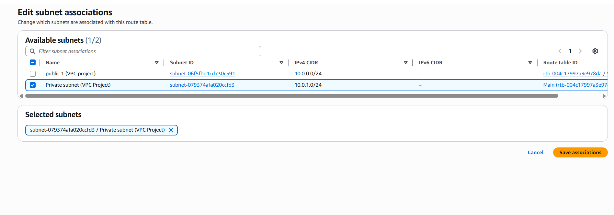
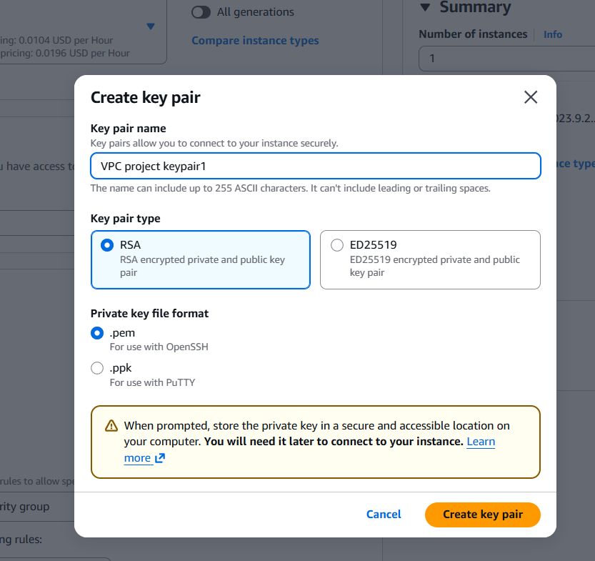
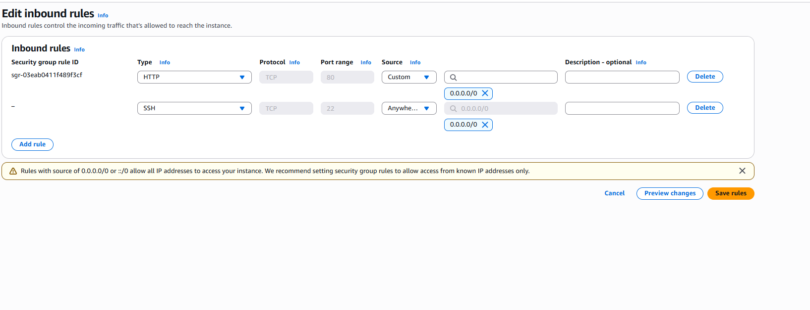

# AWS VPC Networking Project

## Overview
This project demonstrates the design and implementation of a secure AWS Virtual Private Cloud (VPC) environment. The goal was to build and validate a multi-tier network architecture using AWS networking components and verify connectivity, security, and traffic flow through testing and logging.

## Architecture
The environment includes:
- Custom VPC
- Public and private subnets
- Internet Gateway and route tables
- Security Groups and Network ACLs
- EC2 instances for connectivity testing
- VPC Flow Logs integrated with CloudWatch
- VPC peering configuration
- S3 access via VPC Endpoint with restricted bucket policy

## Technologies Used
- AWS VPC
- Subnets (Public & Private)
- Route Tables
- Internet Gateway (IGW)
- Security Groups
- Network ACLs
- EC2
- VPC Flow Logs
- Amazon CloudWatch
- VPC Peering
- VPC Endpoints (S3)
- Amazon S3

## Key Implementation Steps
1. Created a custom VPC with defined CIDR blocks
2. Configured public and private subnets across availability zones
3. Attached an Internet Gateway and configured route tables
4. Applied Security Groups and Network ACL rules
5. Launched EC2 instances to validate connectivity
6. Enabled VPC Flow Logs and monitored traffic in CloudWatch
7. Implemented VPC peering and tested cross-VPC communication
8. Configured an S3 VPC endpoint and applied a restrictive bucket policy

## Validation & Testing
- Verified internet access from public subnets
- Confirmed restricted access from private subnets
- Tested ICMP and SSH connectivity between instances
- Observed accepted and rejected traffic using VPC Flow Logs
- Validated secure S3 access through the VPC endpoint

## Screenshots
Key screenshots documenting the setup and validation steps are available in the `/screenshots` directory.

## What I Learned
- Designing secure cloud network architectures
- Applying least-privilege networking principles
- Troubleshooting routing and security misconfigurations
- Monitoring and analyzing network traffic using Flow Logs
- Implementing private access to AWS services using VPC endpoints

## Next Improvements
- Add NAT Gateway for outbound access from private subnets
- Automate infrastructure using Terraform
- Extend architecture with load balancers and auto scaling

## Author
Ensizziyo Ziraka

## Architecture & Validation Screenshots

### VPC Overview

### Public and Private Subnets

### Route Tables Configuration

### Security Groups Rules

### Network ACL Rules

### EC2 Connectivity Test

### VPC Flow Logs in CloudWatch

### Advanced Networking Configuration

