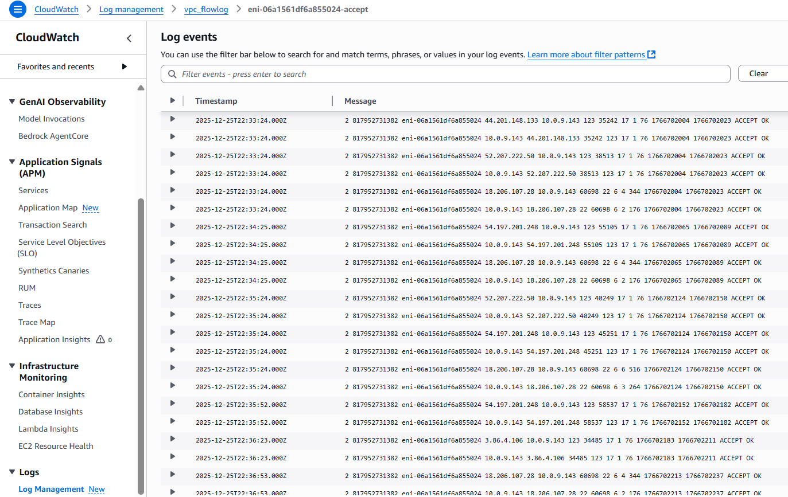
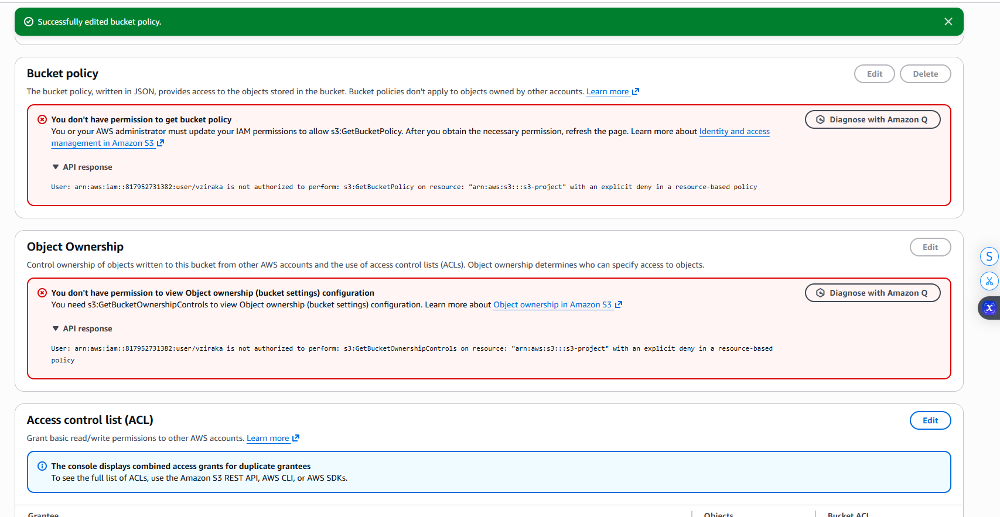

# AWS VPC Networking Project (Public/Private Subnets • Peering • Flow Logs • S3 Endpoint)

## What this project is
I designed and built a **secure AWS VPC environment** to practice real-world cloud networking: segmenting workloads into **public and private subnets**, controlling traffic with **route tables, security groups, and NACLs**, validating connectivity with **EC2 tests**, extending connectivity using **VPC Peering**, and improving visibility + private service access using **VPC Flow Logs (CloudWatch)** and an **S3 Gateway VPC Endpoint**.

This repo contains the **key configuration evidence** (screenshots) and my **implementation rationale**.

---

## Goals
- Build a VPC with **public + private** network segmentation
- Prove traffic behavior with **connectivity tests** (ping/SSH/curl where applicable)
- Practice troubleshooting by iterating security + routing rules
- Connect two VPCs using **VPC Peering** and correct routing
- Enable **network visibility** with VPC Flow Logs → CloudWatch
- Access S3 privately using a **VPC Endpoint** and a restrictive **bucket policy**

---

## Tools & Services Used
- **VPC**, **Subnets**, **Route Tables**, **Internet Gateway (IGW)**
- **Security Groups**, **Network ACLs (NACLs)**
- **EC2** (public + private instances) + key pairs
- **VPC Peering**
- **VPC Flow Logs**, **CloudWatch Logs**, **IAM role/policies** (for Flow Logs)
- **S3**, **S3 Gateway VPC Endpoint**, **S3 bucket policy** restrictions

---

## Architecture (high level)
**Why this layout?**  
Public subnet resources can reach the internet (via IGW). Private subnet resources should **not** be directly reachable from the internet. Instead, access is controlled through routing + security rules and validated through testing.

- **Public Subnet**: internet-routable (IGW route)
- **Private Subnet**: no direct IGW route; controlled east-west traffic
- **Peering**: private routing between two VPCs
- **Flow Logs**: evidence of ACCEPT/REJECT traffic for troubleshooting
- **S3 Endpoint**: private access to S3 without public internet

---

## Build Log (what I did + why)

### 1) Created a custom VPC
I started by creating a custom VPC so I could control CIDR ranges and isolate the environment from defaults.

---

### 2) Created public subnet + enabled public IP behavior
I created a **public subnet** for resources that need internet access. Public subnet instances should receive public IPs (depending on settings).

---

### 3) Attached an Internet Gateway (IGW)
Public subnets need a route to the internet, which requires attaching an **Internet Gateway** to the VPC.

---

### 4) Created route table + associated it to the public subnet
**Thought process:** IGW alone doesn’t provide internet access—subnets must have routes.  
I created a route table that sends `0.0.0.0/0` to the IGW and **associated it to the public subnet**.

---

### 5) Security Group baseline for public access and testing
I configured security group rules to support testing while still keeping the setup understandable.  
(Example: controlled inbound rules for SSH/ICMP as needed for validation.)

---

### 6) Created private subnet + private route table association
I created a **private subnet** and associated it with a **private route table** to keep private workloads separated from direct internet routing.

---

### 7) Applied least-privilege rules for private instance access
The private instance should only accept traffic that is required (e.g., from the public instance / trusted source ranges).  
This is where I tightened security group behavior for the private tier.

---

### 8) Validated connectivity (public → private) and iterated rules
I used EC2-based tests to validate whether traffic was allowed as intended.  
When connectivity failed, I adjusted rules (security group / NACL / routing) and re-tested until expected behavior matched design.

---

## VPC Peering (cross-VPC connectivity)

### 9) Created VPC Peering connection
To practice cross-VPC private connectivity (common in real environments), I created a peering connection.

### 10) Updated route tables for peered CIDR ranges
**Thought process:** Peering does nothing without routes.  
I updated route tables so each VPC knows how to reach the other’s CIDR blocks via the peering connection.

---

## Monitoring & Troubleshooting with Flow Logs

### 11) Captured traffic using VPC Flow Logs
I enabled VPC Flow Logs and pushed them to CloudWatch Logs. This provides evidence of allowed/denied traffic and helps troubleshoot misconfigurations faster than guessing.

### 12) Analyzed Flow Logs in CloudWatch
I reviewed log entries to confirm the actual network decisions (ACCEPT/REJECT) aligned with my intended design.

---

## Private S3 Access Using a VPC Endpoint

### 13) Created S3 Gateway VPC Endpoint
**Why:** Private subnet instances can reach S3 without requiring public internet access.  
I created an S3 Gateway Endpoint and attached it to the correct route table(s).

### 14) Restricted S3 access using bucket policy conditions
I applied a restrictive S3 bucket policy to only allow access through the endpoint (least privilege approach).

### 15) Validated access after final routing adjustments
I validated that the private instance could access S3 through the endpoint once routing was correct.

---

## Key Takeaways (what I learned)
- **Routing is everything**: IGW/Peering/Endpoints require correct route tables + associations
- **Security controls overlap**: Security Groups and NACLs can both block traffic (debug systematically)
- **Flow Logs reduce guessing**: Use CloudWatch logs to prove whether traffic was accepted or rejected
- **Endpoints + bucket policies** = strong private-access pattern for AWS services

---

## Next Improvements
- Add a **NAT Gateway** to allow private subnet outbound internet (without inbound exposure)
- Rebuild the entire environment using **Terraform** for repeatability
- Add a simple application tier + load balancer to simulate production traffic patterns

---

## Author
Ensizziyo Ziraka
