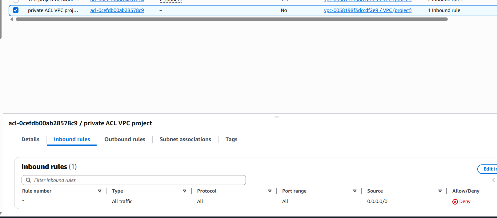

# AWS VPC Networking Project

## Overview
This project demonstrates the design and validation of a secure AWS Virtual Private Cloud (VPC) architecture, focusing on networking, routing, security controls, and traffic monitoring.

## Architecture & Configuration

## Security & Access Controls

## Validation & Monitoring

## Advanced Networking

## Technologies Used
- AWS VPC
- Subnets
- Route Tables
- Internet Gateway
- Security Groups
- Network ACLs
- EC2
- VPC Flow Logs
- CloudWatch
- VPC Peering
- VPC Endpoints (S3)

## Author
Ensizziyo Ziraka
